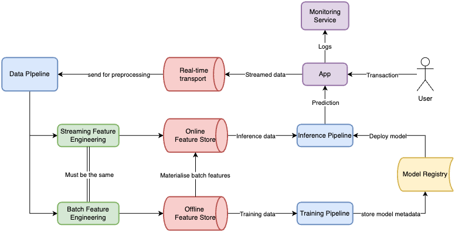

# 🕵 Real-time Fraud Detection ML System

This project aims to be an end-to-end online prediction service to detect fraud.
The project is intended to provide an overview of how online prediction systems work, and to understand
how various tools and resources are used to make the system possible.

---

# 📑 Contents

[📑Overview](#overview) \
[🧩System Design](#system-design) \
[🏗Project Structure](#project-structure) \
[ ⚙️Setup](#setup) \
[🎯Getting Started](#getting-started)

---

# 📑 Overview

The project is split into three areas:

- `services` -> Handles system infrastructure including data streaming pipeline, feature storage, and model serving.
- `packages` -> Custom packages used to provide data processing and model training logic.
- `pipelines` -> Automated pipelines scheduled to run at regular intervals including model retraining and batch feature generation.

## 🧰 Services

| **Service**             | **Description**                                                                                                                                      |
| ------------------- | ------------------------------------------------------------------------------------------------------------------------------------------------ |
| **Kafka Producer**      | Streams data to the `Kafka` broker                                                                                                               |
| **Feature Transformer** | Kafka consumer that processes data in real-time using `polars`                                                                                   |
| **Feature Store**       | Feature storage infrastructure layer to store online and offline features in low latency environment - infrastructure orchestrated using `Feast` |
| **Prediction API**      | Prediction service, built using `FastAPI`, used to serve model predictions to predict fraud on real-time data                                    |
| **Application**         | Frontend UI developed in `Streamlit` to serve results to stakeholders                                                                            |

## 📦 Packages

| **Package**       | **Description**                                                           |
| ------------- | --------------------------------------------------------------------- |
| **Data Package**  | Package that provides data transformation logic in `polars`           |
| **Model Package** | Package containing code to develop, build, and validate new ML models |

## 🚀 Pipelines

| **Pipeline**            | **Description**                                                                                                                                    |
| ------------------- | ---------------------------------------------------------------------------------------------------------------------------------------------- |
| **Training Pipeline**   | Model training pipeline triggered at intervals or by data drift monitoring                                                                     |
| **Batch Data Pipeline** | Pipeline to generate batch features needed at the point of online model serving - pipeline triggered to store latest bathces in online storage |

---

# 🧩 System Design



---

# 🏗 Project Structure

```
.                                                                                                                            ├── LICENSE
├── Makefile                                                                                                                 ├── README.md
├── docker-compose.yml                                                                                                       ├── docs
├── images
├── infra
├── packages
├── pipelines
└── services
```
---

# ⚙️ Setup

## Tools

To setup the project locally, you'll need the following tools:

| **Tool**           | **Version** | **Purpose**                                                  | **Installation** Link                                   |
| -------------- | ------- | -------------------------------------------------------- | --------------------------------------------------- |
| Python         | 3.12    | Programming language runtime                             | [Download](https://www.python.org/downloads/)       |
| uv             | ≥ 0.5.6 | Python package installer and virtual environment manager | [Download](https://github.com/astral-sh/uv)         |
| Docker Desktop | 4.37.2  | Run the project in a containerised environment           | [Download](https://docs.docker.com/engine/install/) |
| GNU Make       | ≥ 3.81  | Build automation tool                                    | [Download](https://www.gnu.org/software/make/)      |

---

# 🎯 Getting Started

To start the services we need to run the `docker-compose.yml`. We can do this by running the following `make` commands.
Make sure `Docker Desktop` is running in the background.

The build command builds our Docker images.

```bash
make build
```

A caviet to this command is that you need to have `AWS` infrastructure setup so that the we can install our package
dependencies from AWS Codeartifact - our local Pypi server where the `data-pipeline` and `model-pipeline` packages
are located.

To then start the services run this:

```bash
make up
```
